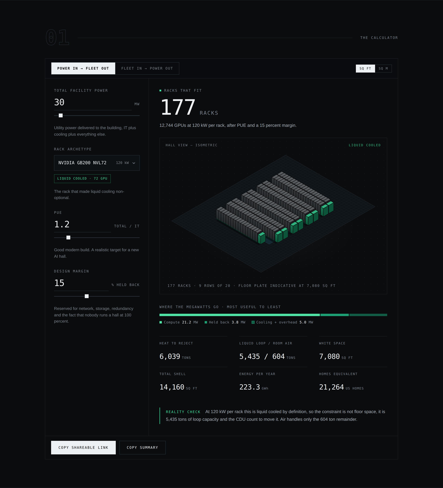
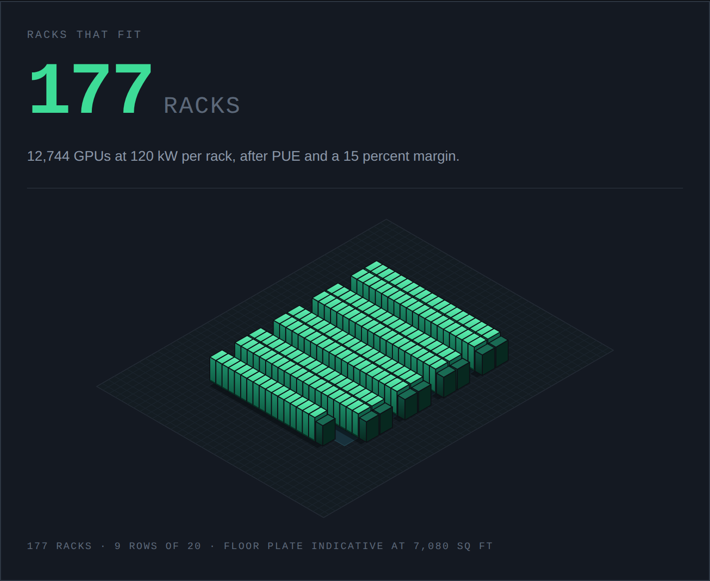
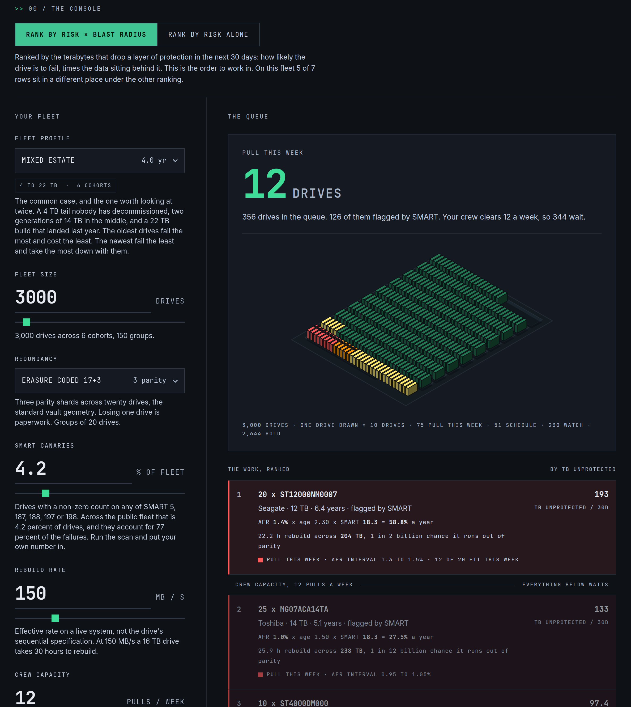

<picture>
  <source media="(prefers-color-scheme: dark)" srcset=".github/assets/logo/glyph/infrabench-logo-glyph.svg">
  
</picture>

<p><strong>Published specs, corrected for reality.</strong><br>
Open tools for the people who build data centers.</p>

<p>
  
  
  
  
</p>

---

Nameplate numbers are optimistic. A rack is rated for 600 kW, a drive is rated for
five years, an interconnection queue is rated in gigawatts. None of those survive
contact with a real site.

Infrabench is a small set of free tools that do the correction, on public data,
with every constant shown on the page. No accounts, no tracking, no lead forms.



## The bench

| # | Tool | What it answers | Status |
|---|------|-----------------|--------|
| 01 | **[Rack Budget](rack-budget/)** | You have the megawatts. What actually fits, what heat comes off it, and how much floor it needs. | **Live** |
| 02 | **[Crash Cart](crash-cart/)** | Which drives to pull this week, ranked by risk times blast radius, on 13 years of public fleet telemetry. | **Live** |
| 03 | **Where the power is** | Where you can actually energize a few hundred megawatts before the end of the decade. | Planned |
| 04 | **Outage replay** | What the console showed during a real cloud incident, and how long the truth took to surface. | Planned |

## Rack Budget

Runs the same model in both directions. Start from a power budget and get the fleet,
or start from the fleet and get the power you have to go ask a utility for.

```
30 MW at the fence
  -> divide by PUE 1.20            = 25.0 MW of IT capacity
  -> hold back a 15 percent margin = 21.25 MW usable for compute
  -> divide by 120 kW per GB200    = 177 racks
  -> times 72 GPUs                 = 12,744 GPUs
  -> 21.24 MW of heat / 3.517      = 6,039 tons, 5,435 on the liquid loop
  -> 177 racks x 40 sq ft          = 7,080 sq ft of white space
```

The result draws the hall it describes: racks in rows the way they really sit, hot
and cold aisles between row pairs, row-end CDUs when the archetype is liquid cooled,
and a floor plate scaled to the white space.



Rack archetypes run from a 6 kW legacy 42U to the 600 kW Rubin Ultra / Kyber rack,
so the density cliff is visible rather than described. Every input is encoded in the
URL, so any configuration is a link you can paste into a thread and argue about.

## Crash Cart

A fleet-wide failure rate tells you how many drives die this year. It does not tell
you which ones, and it does not tell you which deaths cost anything. Crash Cart turns
a fleet into a ranked work queue, and shows the evidence behind every row.



Each row is one drive population carried through the same four multiplications:

```
600 x Toshiba MG07ACA14TA, 14 TB, 5.1 years, 25 of them flagged by SMART
  -> lifetime AFR                          = 1.0 percent a year
  -> times the age multiplier at 5.1 years = 1.51 percent
  -> times the flagged likelihood ratio    = 27.5 percent a year
  -> over 30 days, across 25 drives        = 0.56 expected failures
  -> each opens a 25.9 h rebuild of a 17+3 group holding 238 TB
  -> 133 TB drops to two parity units this month, and that is the sort key
  -> chance any of it is actually lost: about 1 in 12 billion
```

The interesting part is the last line. Three parity units means the work is real and
the danger is not, and the tool says so instead of selling you redundancy you already
have. Switch the geometry to RAID 5 and the same fleet becomes near certain to lose
data inside a year, because at 1 in 10^15 an unrecoverable read during a 41 hour
rebuild is likelier than a second drive dying.

Two things drive the ranking that a failure rate alone cannot see:

**SMART read as evidence, not as an alarm.** Across the public fleet 76.7 percent of
failed drives had a non-zero count on at least one of SMART 5, 187, 188, 197 and 198,
against 4.2 percent of healthy ones. That is a likelihood ratio of about 18 for a
flagged drive and 0.24 for a clean one. Multiply, do not threshold. The consequence is
that a clean six-year-old drive is probably fine and a flagged one-year-old is not.

**Blast radius.** A failure starts a rebuild, and every surviving drive in the group is
exposed for the length of it. Ranked by failure probability alone, the queue leads with
small old drives that fail constantly and cost nothing. Ranked by risk times blast
radius, 5 of the 7 rows in the default fleet move.

The queue is cut at your crew's real capacity, because the constraint is usually hands
rather than information. If drives join the queue faster than you clear it, the tool
says that too, and no amount of reordering fixes it.

## How these are built

**Public data only.** Every input is something you could download yourself. Nothing
proprietary, nothing behind an NDA, nothing you have to take on trust.

**Constants in the open.** Each tool states its assumptions and shows the arithmetic
that produced every number. If you disagree with a constant, you know exactly which
one to argue with.

**One decision out.** Numbers on a screen are data. Each tool ends by naming the
thing that will actually stop you, because that is the part someone has to act on.

## Technical notes

Plain HTML, CSS and vanilla JavaScript. One file per tool. No framework, no bundler,
no build step, no dependencies at runtime or at deploy time. The whole model is
readable with view-source.

Both tools draw their subject rather than charting it, in the same isometric
projection and upper-left light, as SVG polygons generated in about sixty lines
rather than by a 3D library. Rack Budget draws the hall: racks in rows the way they
really sit, hot and cold aisles, row-end CDUs. Crash Cart draws the fleet as 3.5 inch
drives standing on end in chassis rows, ordered worst band first and filled from the
front, so the work stands at the near edge and a fleet that has aged into the queue
is a wall of colour before you have read a number. Both paint back to front, which in
this projection means ascending x plus y.

Chart colour is validated rather than eyeballed. The megawatt split is a single-hue
ordinal ramp (`#4FE3A5` to `#1E9E73` to `#125C46`) checked for monotone lightness,
adjacent step separation and contrast against the dark surface. An earlier
three-hue version was rejected for failing colour-blind separation at deltaE 7.3
under protanopia.

Crash Cart needed a risk ramp, which is harder: urgency wants warm hues, and warm hues
collapse into one another under deuteranopia. The four bands (`#3DDC97` hold,
`#FFEA6B` watch, `#FF9802` schedule, `#FF5B5B` pull) were searched rather than picked,
maximising the worst-case separation over every pair under normal vision and all three
dichromacies. The result holds at deltaE 12.0. A first attempt with five bands got as
low as deltaE 6.9, worse than the ramp already rejected once. The deepest step lands at
Lc 45 on this surface, short of the Lc 60 floor for label text, so the band colour is
only ever a fill or a rule and every band is spelled out in words beside it.

### Running it locally

```bash
python3 -m http.server 8000
# then open http://localhost:8000
```

That is the entire toolchain.

### Deploying

See **[DEPLOY.md](DEPLOY.md)** for the Vercel walkthrough, DNS records, the
post-deploy checklist, and how to add the next tool.

## Sources

Rack power figures come from NVIDIA platform disclosures as reported by
[Data Center Dynamics](https://www.datacenterdynamics.com/en/analysis/nvidia-gtc-jensen-huang-data-center-rack-density/),
[Silicon Report](https://www.siliconreport.com/nvidia-vera-rubin-everything-we-know-33727d4d)
and [TechRadar Pro](https://www.techradar.com/pro/megawatt-class-ai-server-racks-may-well-become-the-norm-before-2030-as-nvidia-displays-600kw-kyber-rack-design).
PUE bands come from [Uptime Institute](https://intelligence.uptimeinstitute.com/resource/mapping-pue-trends-data-center-region-age-and-size)
survey data.

Drive models, lifetime annualized failure rates and drive day counts come from
[Backblaze Drive Stats](https://www.backblaze.com/cloud-storage/resources/hard-drive-test-data),
published quarterly since 2013 and released for any use with attribution. The five
predictive SMART attributes and their prevalence come from Backblaze's
[analysis of SMART stats against real failures](https://www.backblaze.com/blog/what-smart-stats-indicate-hard-drive-failures/).
Unrecoverable read error rates are the manufacturer specifications on current
enterprise nearline datasheets. Drive figures are rounded, and the quarterly table
moves, so re-pull it before spending money against a decimal.

Figures are public as of 2026 and change fast.

These are planning heuristics for the first conversation, not engineering
submittals. Nothing here replaces a mechanical engineer.

## License

MIT. See [LICENSE](LICENSE).

---

Built by [Adrian Mucha](https://portfolio-repo-gilt.vercel.app), a product designer
working on the software most designers avoid: data centers, AI tooling, and operator
consoles where a wrong click costs real money.
